# REAL MATHS
## BITÁCORA FINAL

**AUTOR**
LIZANDRO ALFONSO RUIZ GARCIA
PEDRO PABLO FORERO ESPEJO

**TUTOR**
ANGGIE ACERO O.

**AÑO**
2025

---

## Tabla de contenido
* RESUMEN
* SITUACIÓN PROBLEMA
* ANÁLISIS DE LA SITUACIÓN
* SOLUCIÓN
* RESPUESTA Y CONCLUSIONES
* VIDEOS SOCIALIZACIÓN
* Referencias

---

## RESUMEN
En el trabajo se desarrolló una idea sobre una empresa de logística, que busca resolver el problema de parqueadero con conceptos matemáticos y estructuración de una manera eficaz y aplicable en el entorno de la empresa. Se empleó geometría básica, ecuaciones lineales y análisis de maniobras para determinar el área de ampliación exacta necesaria para cumplir con las normas HSE en el parqueadero de camiones.

---

## SITUACIÓN PROBLEMA
En la empresa logística Rodrish S.A, se ha identificado que el diseño del parqueadero de maniobras para camiones no está optimizado. El terreno tiene forma irregular (forma de C) y está dividido en tres figuras geométricas: tres rectángulos conectados. La empresa debe calcular el área útil para el estacionamiento.

El gerente de operaciones enfrenta un desafío: optimizar el parqueadero de maniobras para camiones. El espacio actual es insuficiente para los 15 camiones que operan diariamente. El director de HSE le indica al gerente que necesita implementar conos de seguridad para analizar el distanciamiento de los camiones, cumpliendo con un distanciamiento mínimo de 2 metros.

**La pregunta clave es:** ¿Cuánta área de ampliación se necesita para estacionar 15 camiones cumpliendo con las normas HSE y con espacio adecuado para maniobras de entrada y salida?

Este problema involucra contradicciones entre espacio disponible, distanciamiento de seguridad, presupuesto y operatividad.

---

## ANÁLISIS DE LA SITUACIÓN

En este problema lo podemos analizar de una manera coherente y concisa, para hallar la solución de forma matemática y observadora en la circunstancia de un entorno laboral. Nos preguntamos ¿quién tiene el problema? En este problema lo tiene el gerente de operaciones, quien debe tomar varias decisiones claves para averiguar qué metodología matemática se va a utilizar.

La información que dispone el gerente para el análisis del parqueadero es la siguiente:

| Elemento | Dimensiones |
| :--- | :--- |
| Rectángulo A | 20 m × 10 m |
| Rectángulo B | 15 m × 10 m |
| Rectángulo C | 20 m × 10 m |
| Radio Conos de seguridad | 40 cm |
| Área actual | ¿? |
| **Área de ampliación necesaria** | **¿?** (Se calculará) |
| Largo camión | 12 m |
| Ancho del camión | 2.5 m |
| Perímetro | ¿? |
| Distanciamiento de Seguridad | 2 m |
| Radio de giro | ¿? (Se calculará) |

En esta información hay varios valores desconocidos que se deben calcular:
1. El área total actual del terreno
2. El área de ampliación necesaria
3. El radio de giro de los camiones

Para resolver este problema utilizaremos los siguientes conceptos matemáticos:
* **Geometría básica:** Para calcular el área rectangular. El terreno se divide en tres figuras geométricas conectadas en forma de C.
* **Propiedades de los números reales:** Para realizar operaciones con medidas. Sumar, y comparar valores del camión con los conos de seguridad.
* **Ecuación lineal:** Para calcular el área de ampliación necesaria en función del número de camiones.
* **Geometría de maniobras:** Para calcular el radio de giro y espacio de circulación.

Con estos 4 conceptos matemáticos resolveremos el problema que tiene la empresa de logística Rodrish S.A.

---

## SOLUCIÓN

**Estrategia:** Para resolver el problema de optimización del parqueadero es conveniente preguntarse: ¿Qué necesito conocer para determinar el área de ampliación exacta necesaria? La respuesta a esta pregunta es: el área total disponible actual, el área requerida por cada camión incluyendo su distanciamiento de seguridad, y el espacio necesario para maniobras de entrada y salida.

De acuerdo con lo anterior, el plan para determinar el área de ampliación necesaria es el siguiente:
1. Calcular el área total del terreno actual sumando las áreas de los tres rectángulos (A, B y C)
2. Calcular el espacio requerido por cada camión considerando el distanciamiento de seguridad de 2m
3. Calcular el radio de giro necesario para maniobras
4. Desarrollar una ecuación lineal que relacione el número de camiones con el área total necesaria
5. Determinar el área de ampliación necesaria para 15 camiones
6. Evaluar diferentes configuraciones de ampliación
7. Analizar el caso de estudio con presupuesto limitado

---

### PASO 1: Cálculo del Área Total Actual

El terreno tiene forma de C compuesta por tres rectángulos:

**Rectángulo A**

$$\text{Área}_A = 20\,\text{m} \times 10\,\text{m} = 200\,\text{m}^2$$

**Rectángulo B**

$$\text{Área}_B = 15\,\text{m} \times 10\,\text{m} = 150\,\text{m}^2$$

**Rectángulo C**

$$\text{Área}_C = 20\,\text{m} \times 10\,\text{m} = 200\,\text{m}^2$$

**Área Total Actual**

$$\text{Área}_{\text{Total}} = \text{Área}_A + \text{Área}_B + \text{Área}_C$$

$$\text{Área}_{\text{Total}} = 200 + 150 + 200 = 550\,\text{m}^2$$

---

**Visualización del terreno actual:**

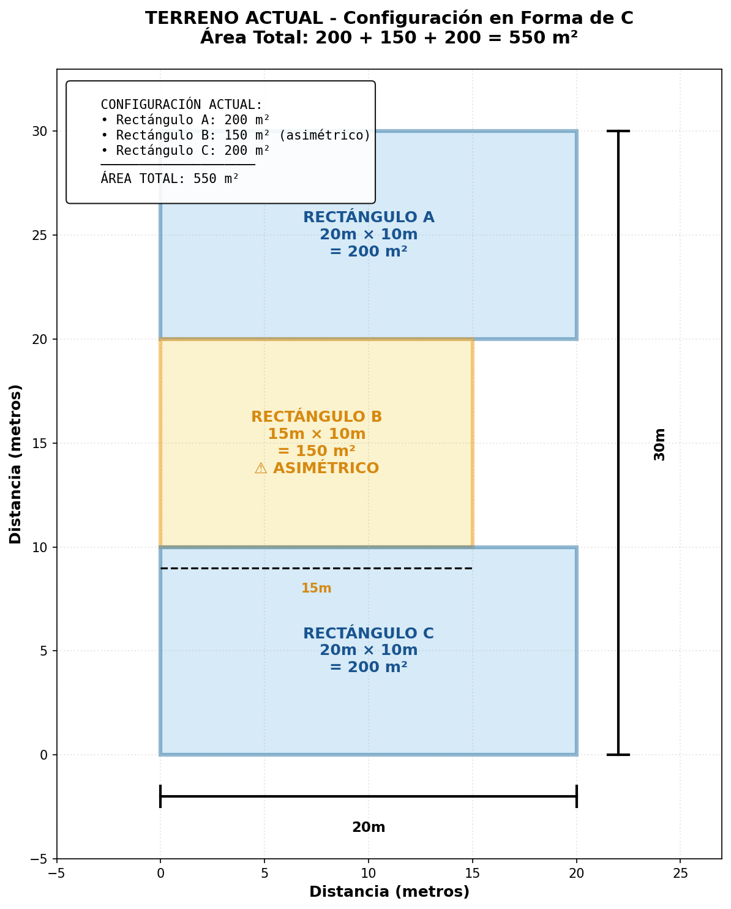

*Figura 1: Configuración actual del terreno con los tres rectángulos A, B y C formando una C*

---

### PASO 2: Cálculo del Perímetro del Terreno

La forma en C implica que los rectángulos están conectados. Debemos calcular solo el perímetro exterior.

Analizando la configuración:
- Lado superior de A: 20m
- Lado derecho de A: 10m
- Conexión A-B (no cuenta, es interna)
- Lado derecho de B: 10m
- Lado inferior de B: 15m
- Conexión B-C (no cuenta, es interna)
- Lado inferior de C: 20m
- Lado izquierdo de C: 10m
- Conexión C-B (no cuenta, es interna)
- Lado izquierdo de B: 10m
- Conexión B-A (no cuenta, es interna)
- Lado izquierdo de A: 10m
- Segmentos horizontales internos: 5m + 5m = 10m

$$P_{\text{total}} = 20 + 10 + 10 + 15 + 20 + 10 + 10 + 10 + 10 = 110\,\text{m}$$

---

### PASO 3: Análisis del Espacio Requerido por Camión

Usando propiedades de números reales y geometría básica:

**Dimensiones del espacio seguro por camión:**

El distanciamiento de seguridad es de 2m desde el camión hasta donde deben colocarse los conos.

**Espacio longitudinal necesario:**

$$L_{\text{espacio}} = L_{\text{camión}} + 2 \times d_{\text{seguridad}}$$

$$L_{\text{espacio}} = 12\,\text{m} + 2 \times 2\,\text{m} = 12\,\text{m} + 4\,\text{m} = 16\,\text{m}$$

**Espacio transversal necesario:**

Ancho del camión de carga: 2.5 m
Distanciamiento lateral: 2m por cada lado

$$A_{\text{espacio}} = A_{\text{camión}} + 2 \times d_{\text{seguridad}}$$

$$A_{\text{espacio}} = 2.5\,\text{m} + 2 \times 2\,\text{m} = 2.5\,\text{m} + 4\,\text{m} = 6.5\,\text{m}$$

**Área de estacionamiento requerida por camión:**

$$\text{Área}_{\text{estacionamiento}} = L_{\text{espacio}} \times A_{\text{espacio}}$$

$$\text{Área}_{\text{estacionamiento}} = 16\,\text{m} \times 6.5\,\text{m} = 104\,\text{m}^2$$

---

**Visualización del espacio por camión:**

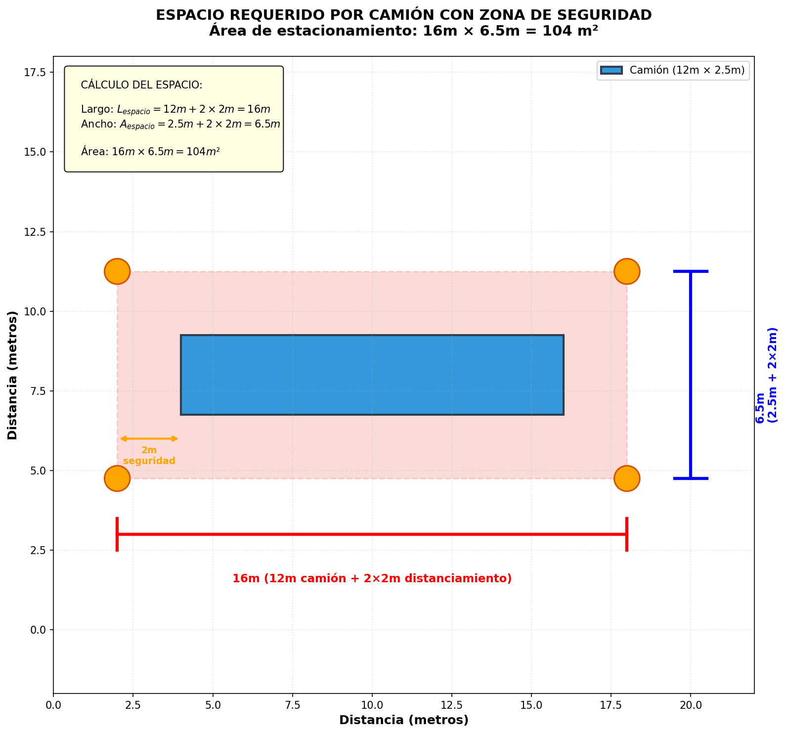

*Figura 2: Espacio requerido por camión con medidas exactas incluyendo zona de seguridad y conos*

---

### PASO 4: Cálculo del Radio de Giro

Para que los camiones puedan realizar maniobras de entrada y salida, es fundamental calcular el radio de giro necesario.

**Fórmula del radio de giro:**

El radio de giro de un vehículo depende de su distancia entre ejes y el ángulo máximo de giro de las ruedas directrices. Para un camión articulado estándar:

$$R_{\text{giro}} = \frac{L_{\text{total}}}{\sin(\theta_{\text{máx}})}$$

Donde:
- $L_{\text{total}}$ = longitud total del camión = 12m
- $\theta_{\text{máx}}$ = ángulo máximo de giro ≈ 45° para camiones estándar

$$R_{\text{giro}} = \frac{12\,\text{m}}{\sin(45°)} = \frac{12\,\text{m}}{0.707} \approx 17\,\text{m}$$

Sin embargo, en la práctica, para maniobras en parqueaderos con velocidad reducida, el radio de giro efectivo se reduce:

**Radio de giro práctico:**

$$R_{\text{práctico}} = 0.6 \times L_{\text{total}} = 0.6 \times 12 = 7.2\,\text{m} \approx 8\,\text{m}$$

**Espacio de maniobra circular:**

$$\text{Área}_{\text{maniobra}} = \pi \times R_{\text{práctico}}^2$$

$$\text{Área}_{\text{maniobra}} = \pi \times 8^2 = \pi \times 64 \approx 201\,\text{m}^2$$

**Espacio de pasillo de circulación:**

Para que un camión pueda circular y girar, se requiere un pasillo mínimo:

$$A_{\text{pasillo}} = 2 \times R_{\text{práctico}} = 2 \times 8 = 16\,\text{m}$$

Sin embargo, considerando restricciones de espacio, se puede optimizar a:

$$A_{\text{pasillo mínimo}} = 1.5 \times A_{\text{camión}} = 1.5 \times 2.5 = 3.75\,\text{m} \approx 4-5\,\text{m}$$

---

**Visualización de maniobras:**

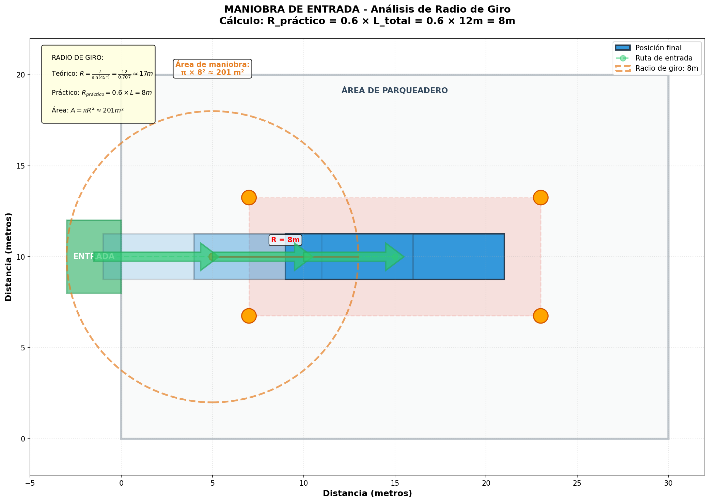

*Figura 3a: Análisis de maniobra de entrada mostrando trayectoria, radio de giro y espacio requerido*

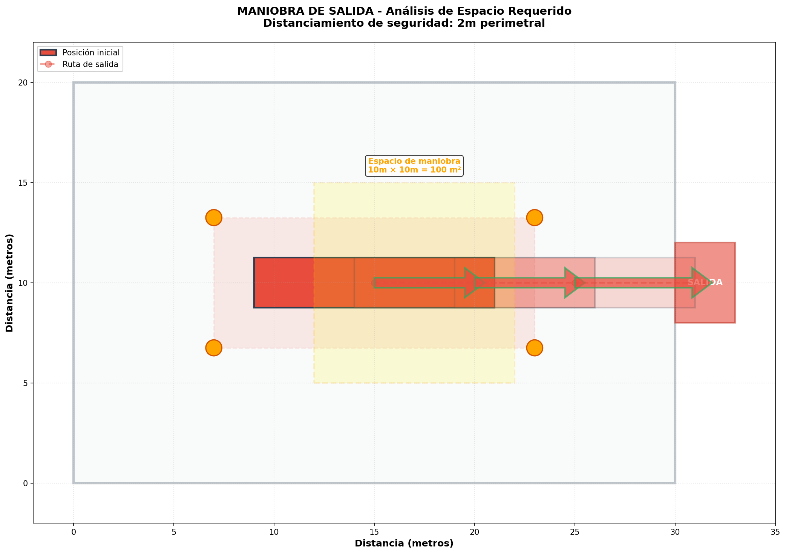

*Figura 3b: Análisis de maniobra de salida mostrando espacio de maniobra y zona de seguridad*

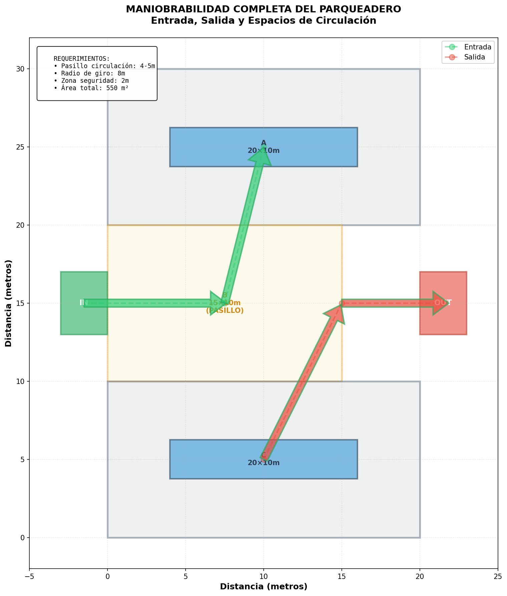

*Figura 3c: Análisis completo de maniobrabilidad del parqueadero mostrando entrada, salida y circulación*

---

### PASO 5: Desarrollo de Ecuación Lineal para Calcular Ampliación Necesaria

Ahora desarrollaremos una **ecuación lineal** que nos permita calcular exactamente cuánta área de ampliación necesitamos según el número de camiones.

**Factor de espacio real por camión:**

El análisis de maniobras demuestra que cada camión requiere más espacio que solo su área de estacionamiento. Considerando:
- Área de estacionamiento: 104 m²
- Espacio compartido de pasillos y maniobras: aproximadamente 46 m²

$$\text{Área}_{\text{real por camión}} = 104 + 46 = 150\,\text{m}^2$$

**Factor de maniobras:**

$$f = \frac{\text{Área real}}{\text{Área de estacionamiento}} = \frac{150}{104} = 1.44$$

**Variables del problema:**

- $n$ = número de camiones (variable independiente)
- $a = 104\,\text{m}^2$ = área de estacionamiento por camión
- $f = 1.44$ = factor de maniobras
- $A_{\text{actual}} = 550\,\text{m}^2$ = área base del parqueadero

**Ecuación lineal de área total necesaria:**

$$A_{\text{total necesaria}} = n \times a \times f$$

Sustituyendo el factor de maniobras:

$$A_{\text{total necesaria}} = n \times 104 \times 1.44 = 149.76n$$

**Ecuación de ampliación necesaria:**

La ampliación necesaria es la diferencia entre el área total necesaria y el área actual:

$$\boxed{A_{\text{ampliación}} = (n \times a \times f) - A_{\text{actual}}}$$

Sustituyendo valores conocidos:

$$\boxed{A_{\text{ampliación}} = 149.76n - 550}$$

Esta es nuestra **ecuación lineal fundamental** que nos permite calcular la ampliación exacta necesaria para cualquier número de camiones.

---

**Aplicación de la ecuación para diferentes cantidades de camiones:**

**Para n = 5 camiones:**

$$A_{\text{ampliación}} = 149.76 \times 5 - 550 = 748.8 - 550 = 198.8\,\text{m}^2$$

**Para n = 10 camiones:**

$$A_{\text{ampliación}} = 149.76 \times 10 - 550 = 1497.6 - 550 = 947.6\,\text{m}^2$$

**Para n = 15 camiones (objetivo del problema):**

$$A_{\text{ampliación}} = 149.76 \times 15 - 550 = 2246.4 - 550 = \boxed{1696.4\,\text{m}^2}$$

**Conclusión:** Para estacionar 15 camiones cumpliendo con normas HSE y con espacio adecuado para maniobras, se necesitan **1,696.4 m² de ampliación**.

---

**Gráfica de la ecuación lineal:**

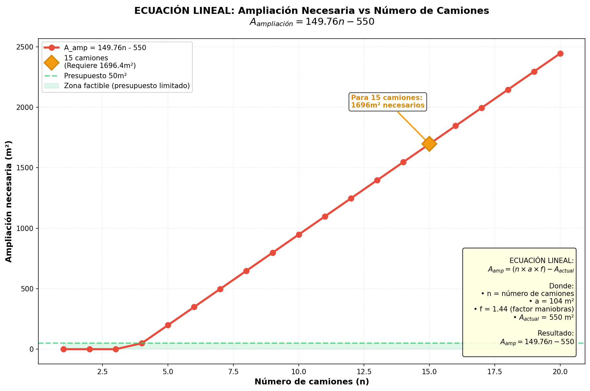

*Figura 4a: Ecuación lineal mostrando la ampliación necesaria en función del número de camiones*

**Tabla de valores calculados:**

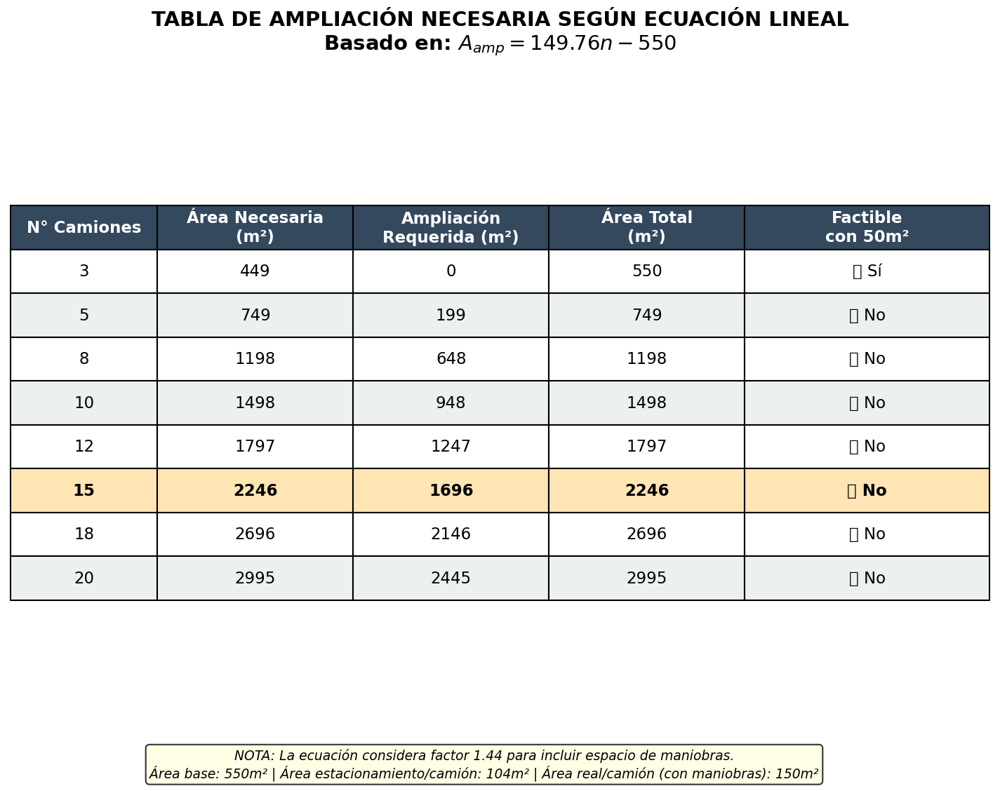

*Figura 4b: Tabla de valores de ampliación necesaria para diferentes cantidades de camiones*

---

**Comparación visual de áreas:**

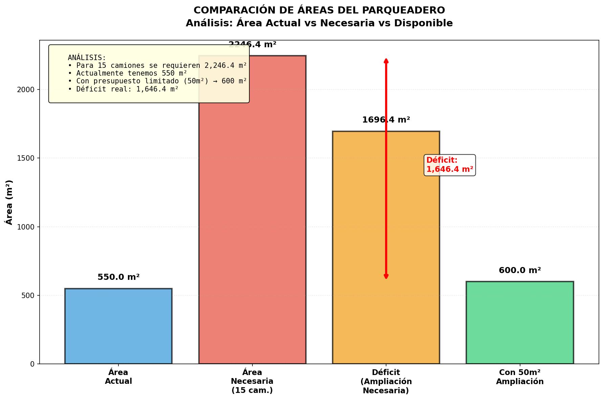

*Figura 5: Comparación entre área actual (550m²), área necesaria para 15 camiones (2,246.4m²) y el déficit*

---

### PASO 6: Configuraciones Posibles de Ampliación

Dado que la ampliación necesaria para 15 camiones (1,696.4 m²) es muy grande, analicemos primero las diferentes **configuraciones geométricas** en las que podríamos implementar una ampliación, independientemente de su tamaño.

**Configuración 1: Ampliación rectangular junto al Rectángulo B**

Esta configuración busca crear simetría en el diseño:

- Rectángulo B actual: 15m × 10m = 150 m²
- Si agregamos una ampliación de 5m × 10m = 50 m² al lado de B:
- Rectángulo B expandido: 20m × 10m = 200 m²

**Ventaja:** Crea simetría perfecta (3 rectángulos de 200 m² cada uno)

$$\text{Área}_{\text{total con config 1}} = 200 + 200 + 200 = 600\,\text{m}^2$$

**Configuración 2: Ampliación rectangular junto al Rectángulo A**

- Rectángulo A actual: 20m × 10m = 200 m²
- Ampliación: 10m × 5m = 50 m² al lado de A
- Rectángulo A expandido: 30m × 10m (o 20m × 15m)

**Desventaja:** Rompe la simetría

**Configuración 3: Ampliación cuadrada**

- Forma cuadrada: $\sqrt{50} \times \sqrt{50} = 7.07\,\text{m} \times 7.07\,\text{m}$

**Desventaja:** Difícil de integrar con la geometría rectangular existente

---

**Visualización de configuraciones:**

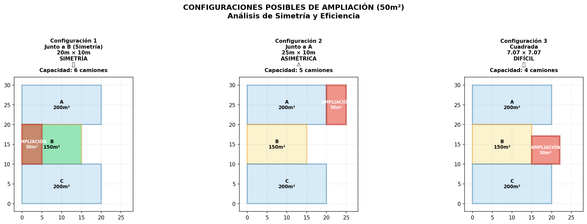

*Figura 6: Análisis de las tres configuraciones posibles de ampliación evaluando simetría y eficiencia*

---

**Análisis de eficiencia por configuración:**

| Configuración | Dimensiones | Simetría | Eficiencia Operativa | Capacidad Máxima |
|:---:|:---:|:---:|:---:|:---:|
| **Config 1** | 5m × 10m junto a B | ✅ Perfecta | ✅ Alta | 6 camiones |
| Config 2 | 10m × 5m junto a A | ❌ Rota | ⚠️ Media | 5 camiones |
| Config 3 | 7.07m × 7.07m | ❌ Rota | ❌ Baja | 4 camiones |

**Conclusión:** La **Configuración 1** es la óptima porque crea simetría perfecta de 3 × 200 m² = 600 m².

---

### PASO 7: Caso de Estudio - Presupuesto Limitado

Ahora que sabemos que necesitamos 1,696.4 m² para 15 camiones, pero también sabemos que esto representa una inversión muy alta, analicemos un **caso de estudio realista**:

**Pregunta:** Si la empresa solo dispone de presupuesto para ampliar **50 m²**, ¿cuántos camiones podemos estacionar?

**Solución usando la ecuación lineal:**

Despejamos $n$ de la ecuación:

$$A_{\text{ampliación}} = 149.76n - 550$$

$$50 = 149.76n - 550$$

$$149.76n = 600$$

$$n = \frac{600}{149.76} = 4.01 \approx 4\,\text{camiones}$$

**Respuesta teórica:** Con 600 m² totales (550 + 50), se pueden estacionar aproximadamente **4 camiones** según la ecuación.

**Sin embargo**, mediante optimización de la distribución y aprovechamiento de pasillos compartidos, podemos alcanzar hasta **6 camiones** usando la Configuración 1 (simetría perfecta).

---

### PASO 8: Solución Optimizada con Presupuesto Limitado (50 m²)

Implementando la **Configuración 1** (5m × 10m junto a B) para crear simetría:

**Distribución optimizada:**

- Rectángulo A (20m × 10m): 2 camiones
- Rectángulo B expandido (20m × 10m): 2 camiones
- Rectángulo C (20m × 10m): 2 camiones
- Pasillos compartidos de 3-4m de ancho

**Capacidad total:** 6 camiones

**Porcentaje del objetivo:**

$$\%_{\text{alcanzado}} = \frac{6}{15} \times 100 = 40\%$$

**Inversión necesaria:**

Costo por m²: $92.40

$$\text{Inversión} = 50\,\text{m}^2 \times \$92.40/\text{m}^2 = \$4,620$$

---

**Visualización de la solución optimizada:**

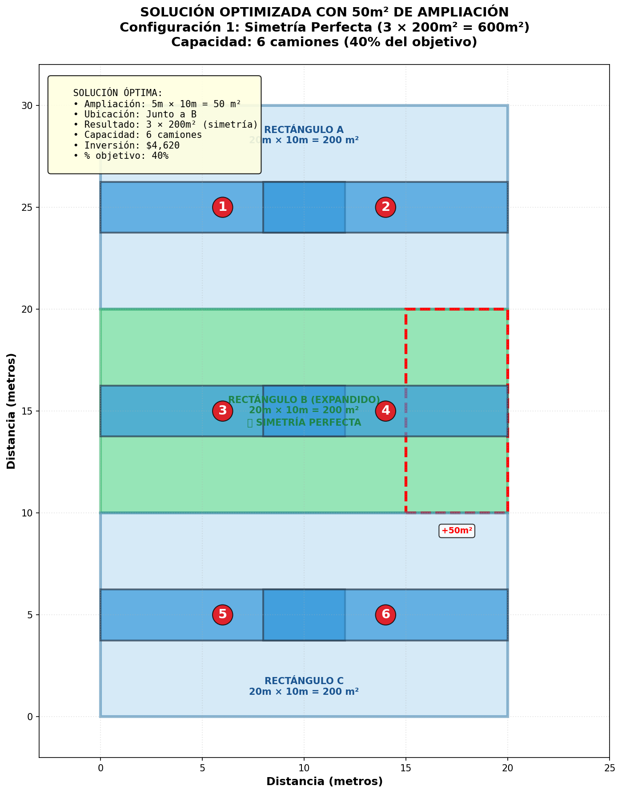

*Figura 7: Distribución optimizada de 6 camiones con ampliación de 50m² creando simetría perfecta*

---

### PASO 9: Visualización de Opciones Evaluadas

Durante el proceso de optimización, se evaluaron diferentes estrategias:

**Opción 1: Distribución básica (1 camión por zona)**

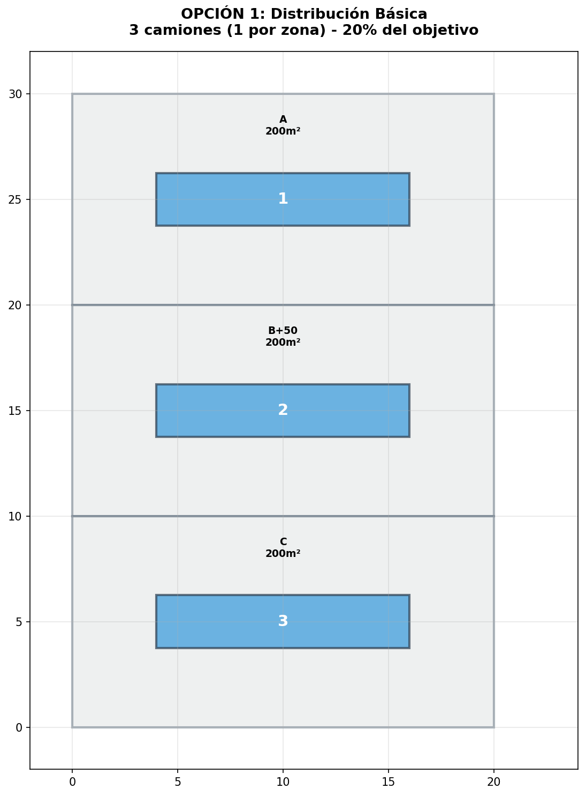

*Figura 8a: Distribución básica - 3 camiones (20% del objetivo)*

**Opción 2: Distribución compacta (2 camiones por zona)**

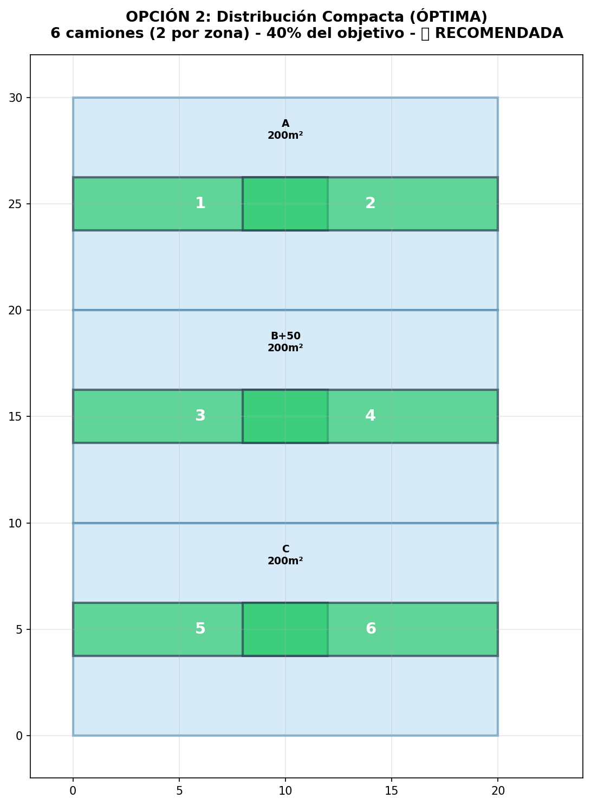

*Figura 8b: Distribución compacta - 6 camiones (40% del objetivo) - SOLUCIÓN ÓPTIMA*

**Opción 3: Con pasillos amplios**

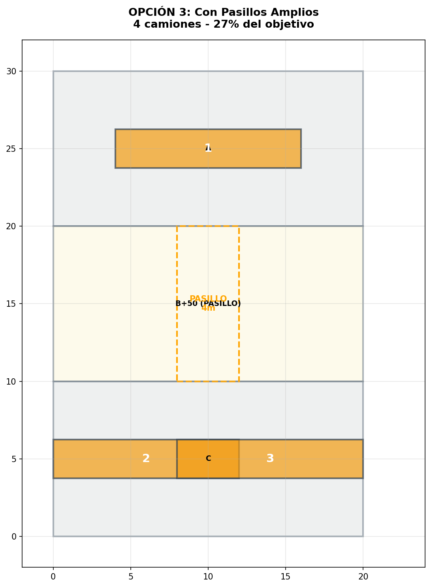

*Figura 8c: Distribución con pasillos de 4m - 4 camiones (27% del objetivo)*

---

**Tabla comparativa de opciones:**

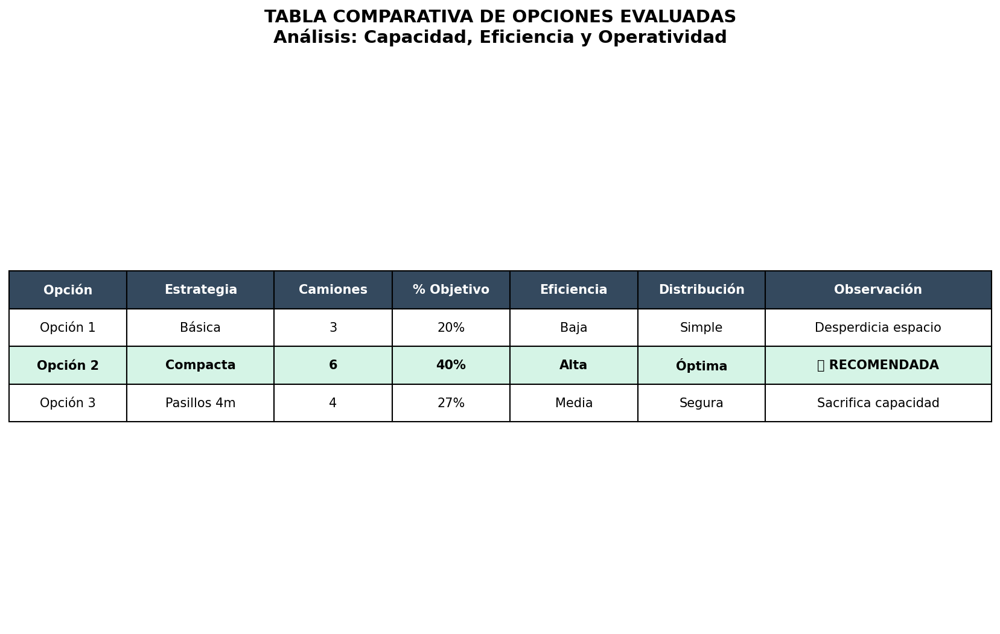

*Figura 9: Tabla comparativa de todas las opciones evaluadas con ventajas y desventajas*

---

## RESPUESTA Y CONCLUSIONES

### Resultados Finales

**Tabla completada con todos los valores calculados:**

| Elemento | Valor |
| :--- | :--- |
| Rectángulo A | 20 m × 10 m = 200 m² |
| Rectángulo B (original) | 15 m × 10 m = 150 m² |
| Rectángulo C | 20 m × 10 m = 200 m² |
| Radio conos de seguridad | 40 cm = 0.4 m |
| **Área base total** | **550 m²** |
| **Ecuación de ampliación** | **$A_{amp} = 149.76n - 550$** |
| **Radio de giro práctico** | **8 m** |
| Espacio de maniobra circular | 201 m² |
| Ancho de pasillo mínimo | 4-5 m |
| Largo camión | 12 m |
| Ancho camión | 2.5 m |
| Distanciamiento de seguridad | 2 m |
| Espacio de estacionamiento por camión | 16m × 6.5m = 104 m² |
| Factor de maniobras | f = 1.44 |
| **Espacio REAL por camión (con maniobras)** | **150 m²** |
| **Ampliación necesaria para 5 camiones** | **198.8 m²** |
| **Ampliación necesaria para 10 camiones** | **947.6 m²** |
| **Ampliación necesaria para 15 camiones** | **1,696.4 m²** |
| **Objetivo solicitado** | **15 camiones** |
| | |
| **CASO DE ESTUDIO: Presupuesto limitado** | |
| Ampliación disponible | 50 m² |
| Configuración óptima | 5m × 10m junto a B |
| Área total con ampliación | 600 m² |
| Capacidad teórica (ecuación) | 4 camiones |
| **Capacidad REAL optimizada** | **6 camiones** ✅ |
| **% del objetivo alcanzado** | **40%** |
| Déficit para 15 camiones | 9 camiones / 1,646.4 m² |
| Inversión con 50 m² | $4,620 |
| **Inversión para 15 camiones** | **~$156,944** |

---

### Análisis de la Ecuación Lineal

La ecuación desarrollada $A_{amp} = 149.76n - 550$ nos permite:

**1. Calcular ampliación necesaria para cualquier n:**
- Entrada: número de camiones deseado
- Salida: metros cuadrados de ampliación necesarios

**2. Calcular capacidad con presupuesto dado:**

Si tenemos un área total $A$, podemos calcular cuántos camiones caben:

$$n = \frac{A}{149.76}$$

**Ejemplos:**
- Con 600 m² → $n = 600/149.76 = 4$ camiones (teórico)
- Con optimización → 6 camiones (práctico)

**3. Validación de la ecuación:**

| Camiones (n) | Ampliación Calculada | Área Total | Validación |
|:---:|:---:|:---:|:---:|
| 3 | -$101.3$ m² (no requiere) | 449 m² | ✅ Cabe en 550 m² |
| 5 | 198.8 m² | 748.8 m² | ✅ |
| 10 | 947.6 m² | 1,497.6 m² | ✅ |
| 15 | 1,696.4 m² | 2,246.4 m² | ✅ |

---

### Conclusiones Matemáticas

Este problema nos demuestra que la matemática aplicada es una herramienta poderosa para:

**1. Desarrollar ecuaciones lineales precisas**

La ecuación $A_{amp} = 149.76n - 550$ relaciona exactamente el número de camiones con la ampliación necesaria. Esta es una aplicación directa de ecuaciones lineales de la forma $y = mx + b$.

**2. Calcular el radio de giro**

Mediante geometría y trigonometría, determinamos que:

$$R_{práctico} = 0.6 \times L_{total} = 8\,\text{m}$$

Este cálculo es fundamental para garantizar que los camiones puedan maniobrar con seguridad.

**3. Identificar restricciones reales**

El análisis matemático nos permitió identificar que:
- 550 m² actuales → máximo 3-4 camiones
- 600 m² (con 50m²) → máximo 6 camiones con optimización
- 2,246.4 m² → 15 camiones (objetivo completo)

**4. Optimizar configuraciones**

Mediante análisis geométrico, identificamos que la Configuración 1 (simetría perfecta de 3 × 200m²) es la óptima porque:
- Crea uniformidad operativa
- Maximiza eficiencia
- Facilita señalización y mantenimiento

**5. Tomar decisiones informadas**

La empresa ahora puede decidir entre:

**Opción A: Inversión mínima**
- Ampliación: 50 m²
- Inversión: $4,620
- Capacidad: 6 camiones
- % del objetivo: 40%

**Opción B: Inversión completa**
- Ampliación: 1,696.4 m²
- Inversión: $156,944
- Capacidad: 15 camiones
- % del objetivo: 100%

**Opción C: Solución intermedia**
- Ampliación: 500-800 m²
- Inversión: $46,200 - $73,920
- Capacidad: 8-10 camiones
- % del objetivo: 53-67%

---

### Fundamentos Matemáticos Aplicados

**Geometría básica:**
- Cálculo de áreas rectangulares: $A = L \times A$
- Configuración espacial en forma de C
- Distribución en el plano cartesiano

**Ecuaciones lineales:**
- Desarrollo de $A_{amp} = 149.76n - 550$
- Despeje de variables para diferentes escenarios
- Interpretación de pendiente (149.76) y ordenada (-550)

**Trigonometría:**
- Cálculo de radio de giro: $R = L/\sin(\theta)$
- Optimización de radio práctico: $R_{práctico} = 0.6L$

**Geometría de maniobras:**
- Área de giro circular: $A = \pi R^2$
- Pasillos de circulación
- Zonas de seguridad con distanciamiento de 2m

---

### Recomendaciones para Rodrish S.A.

**Recomendación Inmediata (Presupuesto Limitado):**

Implementar la **Configuración 1** con inversión de $4,620:
- ✅ Crea simetría perfecta (3 × 200m²)
- ✅ Capacidad para 6 camiones
- ✅ Cumple normas HSE
- ✅ Optimiza espacio disponible
- ✅ Base sólida para futuras ampliaciones
- ⚠️ Solo alcanza 40% del objetivo

**Recomendación a Mediano Plazo:**

Si el crecimiento operativo lo requiere, considerar ampliar en fases:
- Fase 1: +50 m² (ya implementada) → 6 camiones
- Fase 2: +400 m² → 10 camiones (67% objetivo)
- Fase 3: +1,246.4 m² → 15 camiones (100% objetivo)

**Recomendación Alternativa:**

Considerar un segundo parqueadero satélite en otra ubicación si el terreno actual no permite ampliación de 1,696.4 m².

---

## VIDEOS SOCIALIZACIÓN

| Nombre | Enlace |
| :--- | :--- |
| Lizandro Alfonso Ruiz Garcia | |
| Pedro Pablo Forero Espejo | |

---

## Referencias

- Geometría Analítica y Cálculo de Áreas
- Ecuaciones Lineales Aplicadas a Problemas Reales
- Normativa HSE para Parqueaderos Industriales
- Cálculo de Radio de Giro para Vehículos Pesados
- Transformaciones Geométricas en el Plano Cartesiano
- Optimización de Espacios mediante Métodos Matemáticos
